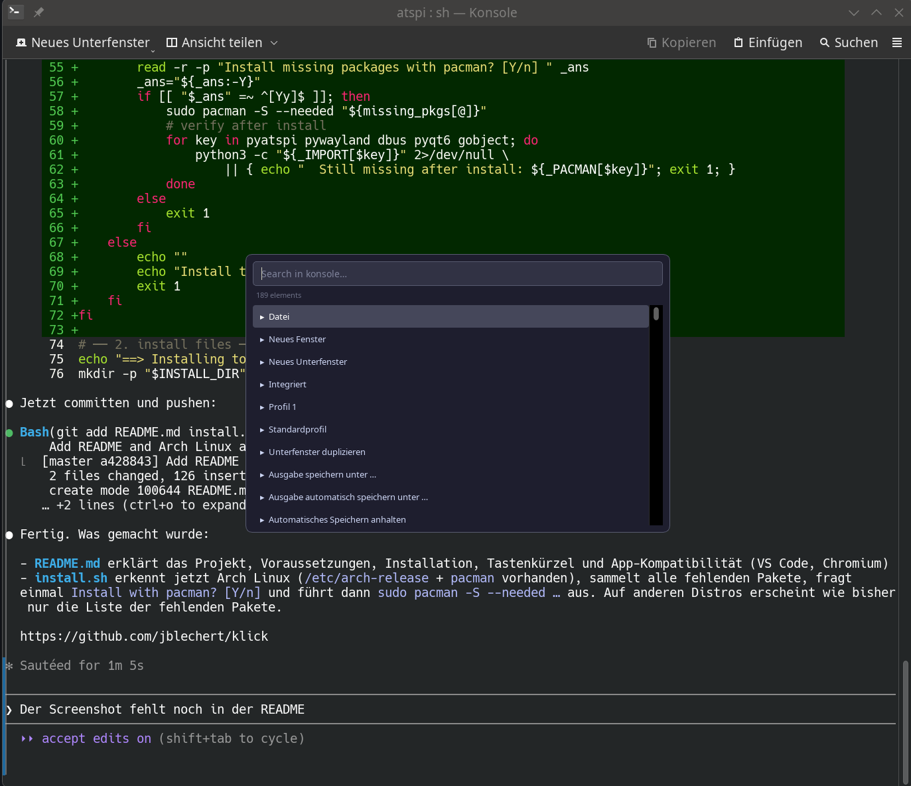
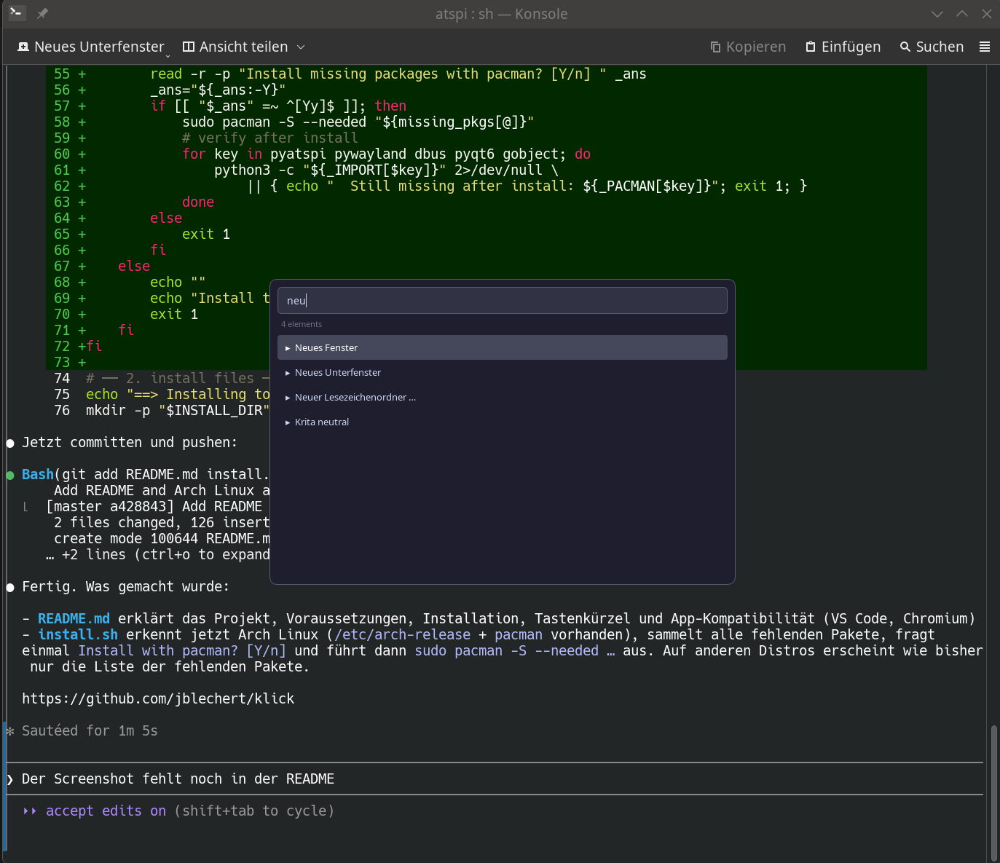

# klick

Keyboard-driven UI element navigator for KDE Plasma 6 on Wayland.

Press a global hotkey over any window, type to fuzzy-search its buttons, menus, tabs, and checkboxes, then hit Enter to activate the element — without touching the mouse.




## How it works

1. A small background daemon registers a global shortcut with KWin via kglobalaccel.
2. When triggered, it launches the search overlay (`main.py`).
3. The overlay reads all accessible UI elements from the focused application using AT-SPI, presents them in a fuzzy-search list, and highlights the selected element on screen using a Wayland layer-shell surface.
4. Pressing Enter activates the element (click, toggle, expand, …) and the overlay closes.

## Requirements

- KDE Plasma 6 on Wayland
- Python 3.11+
- `python-pyatspi`, `python-pyqt6`, `python-pywayland`, `python-dbus`, `python-gobject`

On Arch Linux, `install.sh` will offer to install missing packages automatically.

## Installation

```bash
git clone https://github.com/jblechert/klick.git
cd klick
./install.sh            # binds Meta+F by default
./install.sh "Meta+E"   # custom shortcut
```

The installer:
- Copies files to `~/.local/share/atspi-search/`
- Creates wrapper scripts in `~/.local/bin/`
- Registers a KDE autostart entry so the hotkey daemon starts with your session
- Starts the hotkey daemon immediately

## Usage

| Key | Action |
|-----|--------|
| **Meta+F** | Open search overlay (default shortcut) |
| Type | Filter elements |
| ↓ / Tab | Next element |
| ↑ / Shift+Tab | Previous element |
| Enter | Activate element |
| Escape | Close overlay |

## App compatibility

Most native apps (GTK, Qt, KDE) work out of the box. Some apps require accessibility to be explicitly enabled:

**Chromium / Chrome / Electron apps**
```
--force-renderer-accessibility
```
Add to the app's `.desktop` file or launch via terminal.

**VS Code**
```json
"editor.accessibilitySupport": "on"
```
Add to `settings.json` (`Ctrl+Shift+P` → *Open User Settings (JSON)*).

## Uninstall

```bash
pkill -f atspi-search-hotkey
rm -rf ~/.local/share/atspi-search
rm -f  ~/.local/bin/atspi-search ~/.local/bin/atspi-search-hotkey
rm -f  ~/.config/autostart/atspi-search-hotkey.desktop
rm -f  ~/.config/systemd/user/atspi-search.service
```

## License

MIT
